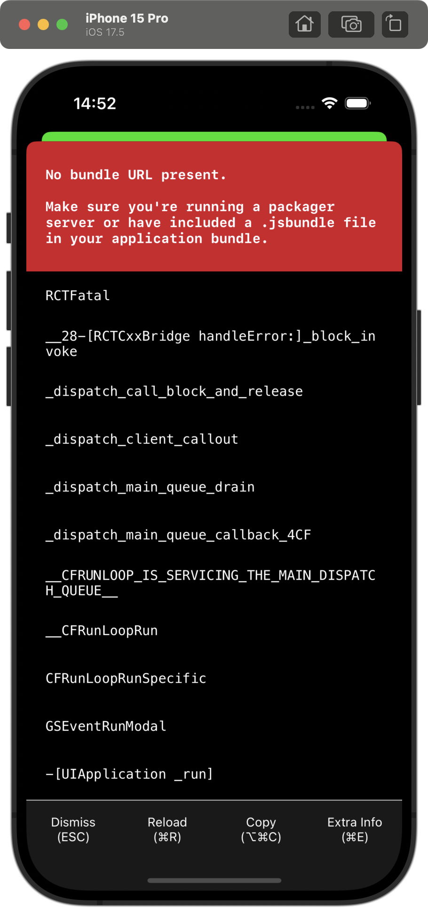

# MixedApp

This Repository contains a step-by-step guide on how to integrate React Native into an iOS application.

The repository starts with a simple app, with two tabs:
* The home tab is a native view where the team is going to work using native technologies
* The settings tab will be a React Native view.

Every commit represents a step toward integrating the React Native into the app.

You can checkout every commit to see if the current state of the project.

## [Initial Commit](https://github.com/cipolleschi/MixedApp/commit/c1f322cb7c124cb732d99cca1985278f1c951efc)

This commit is the initial state. We have the iOS app in the MixedApp folder and currently both tabs are native views.

The goal is to replace the Settings view with a React Native view.

## [Add the ios folder](https://github.com/cipolleschi/MixedApp/commit/2ad3edecd9931b107c5c4532c1193c4d8ad56ca9)

First step to integrate React Native is to move your ios project into a dedicated ios folder.

1. create a new `ios` folder
2. move the `MixedApp` folder inside the `ios` folder

## [Create the package.json and install js dependencies](https://github.com/cipolleschi/MixedApp/commit/q1ea52bc12728ed5a27fc90a915d1e3fba6520815)

We now need to add the React and React Native dependencies to our project.

1. Create a `package.json` file inside the `MixedApp` folder. It must be a sibling of the previous ios folder

2. Paste the following content inside the `package.json`
```json
{
  "name": "MixedApp",
  "version": "0.0.1",
  "private": true,
  "scripts": {
    "start": "yarn react-native start"
  }
}
```

3. Navigate to the `MixedApp` folder and run the following command:
```sh
yarn add react-native@latest
```

4. One of the warning line would be something like:
```sh
warning " > react-native@0.75.3" has unmet peer dependency "react@^18.2.0".
```
so make sure to run also
```sh
yarn add react@^18.2.0
```
5. Add a `.gitignore` file to ignore the `node_modules` folder

## [Create the index.js file]()

The `index.js` file is the entry point for the JS module we want to load in our app.
At the same level of the `package.json`

1. Create and `index.js` file
2. Add the following content to the `index.js` file
```js
import React from 'react';
import {AppRegistry, StyleSheet, Text, View} from 'react-native';

const Settings = ({data}) => {
  return (
    <View style={styles.container}>
      <Text>Settings</Text>
      <Text>{data}</Text>
    </View>
  );
};

const styles = StyleSheet.create({
  container: {
    flex: 1,
    justifyContent: 'center',
    alignItems: 'center',
    backgroundColor: '#EEEEEE',
  },
});

// Module name
AppRegistry.registerComponent('Settings', () => Settings);
```

## [Configure iOS dependencies]()

Now, it's time to link the React Native dependencies to the iOS project.

The tool we use to do that is [Cocoapods](https://cocoapods.org) and Ruby Gems.

Follow the [install instructions](https://cocoapods.org/) in the Cocoapods website

We use [Ruby Bundler](https://bundler.io/) to manage the ruby dependencies.

1. Create a `Gemfile` at the same level of the `package.json` file with this content
```ruby
source 'https://rubygems.org'

# You may use http://rbenv.org/ or https://rvm.io/ to install and use this version
ruby ">= 2.6.10"

# Exclude problematic versions of cocoapods and activesupport that causes build failures.
gem 'cocoapods', '>= 1.13', '!= 1.15.0', '!= 1.15.1'
gem 'activesupport', '>= 6.1.7.5', '!= 7.1.0'
```
2. Inside the iOS folder, create a `Podfile` file, with this content
```ruby
# Resolve react_native_pods.rb with node to allow for hoisting
require Pod::Executable.execute_command('node', ['-p',
  'require.resolve(
    "react-native/scripts/react_native_pods.rb",
    {paths: [process.argv[1]]},
  )', __dir__]).strip

platform :ios, min_ios_version_supported
prepare_react_native_project!

linkage = ENV['USE_FRAMEWORKS']
if linkage != nil
  Pod::UI.puts "Configuring Pod with #{linkage}ally linked Frameworks".green
  use_frameworks! :linkage => linkage.to_sym
end

target 'MixedApp' do
  config = use_native_modules!

  use_react_native!(
    :path => config[:reactNativePath],
    # An absolute path to your application root.
    :app_path => "#{Pod::Config.instance.installation_root}/.."
  )

  post_install do |installer|
    # https://github.com/facebook/react-native/blob/main/packages/react-native/scripts/react_native_pods.rb#L197-L202
    react_native_post_install(
      installer,
      config[:reactNativePath],
      :mac_catalyst_enabled => false,
      # :ccache_enabled => true
    )
  end
end
```
3. Navigate inside the `ios` folder
4. run the `bundle install` command
5. run the `bundle exec pod install` command
6. update the `.gitignore` file to ignore the `**/ios/Pods`, the `**/ios/generated` folder, and the `.xcode.env.local` file

## [Modify the iOS code]()

Now it's time to modify the iOS code to connect with React Native.

React Native is kickstarted by a class called `RCTAppDelegate`. As the name implies, React Native works with the `AppDelegate` hierarchy chain, and not with the `SceneDelegate` hierarchy.

1. Open the project with the command `open ios/MixedApp.xcworkspace`
2. Delete the `SceneDelegate.swift` file
3. In Xcode, select your app icon and the Info tab.
4. Delete the `Application Scene Manifest` line
5. Open the `AppDelegate.swift` file and apply the following changes
```diff
import UIKit
+ import React
+ import React_RCTAppDelegate

@main
-class AppDelegate: UIResponder, UIApplicationDelegate {
+class AppDelegate: RCTAppDelegate {


-  func application(_ application: UIApplication, didFinishLaunchingWithOptions launchOptions: [UIApplication.LaunchOptionsKey: Any]?) -> Bool {
-    // Override point for customization after application launch.
-    return true
-  }
+ override func application(_ application: UIApplication, didFinishLaunchingWithOptions launchOptions: [UIApplication.LaunchOptionsKey: Any]?) -> Bool {
+    super.moduleName = "Settings"
+    self.initialProps = [:];

+    super.application(application, didFinishLaunchingWithOptions: launchOptions)

+    let rootViewController = TabViewController()
+    self.window.rootViewController = rootViewController
+    self.window.makeKeyAndVisible()

+    return true
+}

+  override func sourceURL(for bridge: RCTBridge) -> URL? {
+    return bundleURL()
+  }

+  override func bundleURL() -> URL?
+  {
+  #if DEBUG
+    return RCTBundleURLProvider.sharedSettings().jsBundleURL(forBundleRoot: "index")
+  #else
+    return NSBundle.main .url(forResource: "main", withExtension: "jsbundle")
+  #endif
+  }

-  // MARK: UISceneSession Lifecycle

-  func application(_ application: UIApplication, configurationForConnecting connectingSceneSession: UISceneSession, options: UIScene.ConnectionOptions) -> UISceneConfiguration {
-    // Called when a new scene session is being created.
-    // Use this method to select a configuration to create the new scene with.
-    return UISceneConfiguration(name: "Default Configuration", sessionRole: connectingSceneSession.role)
-  }
-
-  func application(_ application: UIApplication, didDiscardSceneSessions sceneSessions: Set<UISceneSession>) {
-    // Called when the user discards a scene session.
-    // If any sessions were discarded while the application was not running, this will be called shortly after application:didFinishLaunchingWithOptions.
-    // Use this method to release any resources that were specific to the discarded scenes, as they will not return.
-  }
}
```
6. Open the `SettingsViewController.swift` file and modify it as it follows
```diff
import Foundation
+import React
+import React_RCTAppDelegate

class SettingsViewController: UIViewController {

  override func viewDidLoad() {
    super.viewDidLoad()
    // Do any additional setup after loading the view.
-    self.view.backgroundColor = .red
+    self.view = (RCTSharedApplication()?.delegate as? RCTAppDelegate)?.rootViewFactory .view(withModuleName: "Settings", initialProperties: [:])
  }
}
```
7. Select your app in Xcode.
8. Select `Build Settings`
9. in the top right corner, filter for `User Script Sandboxing`
10. Set the value to `NO`.

Now you can build and run your app, but you'll see an error like this one.





The problem is that Metro is not running. The next step will fix this.
